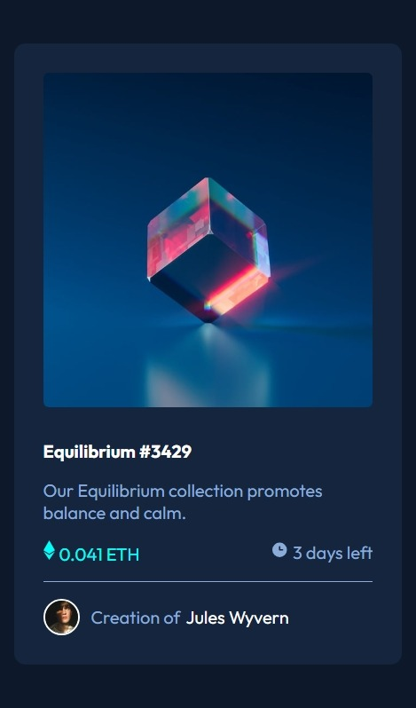
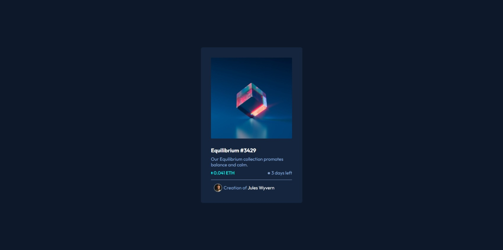

# Make It Real - NFT Preview Card Component

This is a solution to the **NFT Preview Card Component** project of the Make It Real course.

## Table of contents

- [Overview](#overview)
  - [The challenge](#the-challenge)
  - [Screenshot](#screenshot)
- [My process](#my-process)
  - [Built with](#built-with)
  - [What I learned](#what-i-learned)
  - [Continued development](#continued-development)
  - [Useful resources](#useful-resources)
- [Author](#author)

## Overview

### The challenge

Users should be able to:

- View the optimal layout for the site depending on their device's screen size.
- See hover states for all interactive elements on the page.

### Screenshot

#### Mobile



#### Desktop



## My process

### Built with

- Semantic HTML5 markup
- CSS custom properties
- Flexbox
- Mobile-first workflow
- BEM methodology for CSS classes

### What I learned

During this project, I reinforced my understanding of responsive design, especially how to implement a **mobile-first workflow** using **CSS custom properties** and **flexbox**. I also had the opportunity to practice **BEM methodology** to maintain organized and scalable CSS.

Here is an example of the CSS I wrote for the hover state effect:

```css
.card__overlay {
  position: absolute;
  top: 0;
  left: 0;
  width: 100%;
  height: 100%;
  background-color: rgba(0, 255, 255, 0.5);
  display: flex;
  align-items: center;
  justify-content: center;
  opacity: 0;
  transition: opacity 0.3s ease;
  border-radius: 10px;
  cursor: pointer;
}
```

### Continued development

In future projects, I want to:

- Dive deeper into CSS Flex to enhance my layouts, especially for more complex designs.
- Explore more advanced JavaScript interactions to add dynamic elements to my projects.
- Continue refining my understanding and application of **accessibility** best practices in web design.

### Useful resources

- [MDN Web Docs - Flexbox](https://developer.mozilla.org/en-US/docs/Web/CSS/CSS_Flexible_Box_Layout/Basic_Concepts_of_Flexbox) - This resource helped me understand the intricacies of flexbox and how to apply it effectively for responsive design.
- [BEM Methodology](http://getbem.com/introduction/) - This guide on BEM methodology was crucial for keeping my CSS modular and easy to maintain.

## Author

- GitHub - [Jaqueline Ramos](https://github.com/JaquelineRocio)
